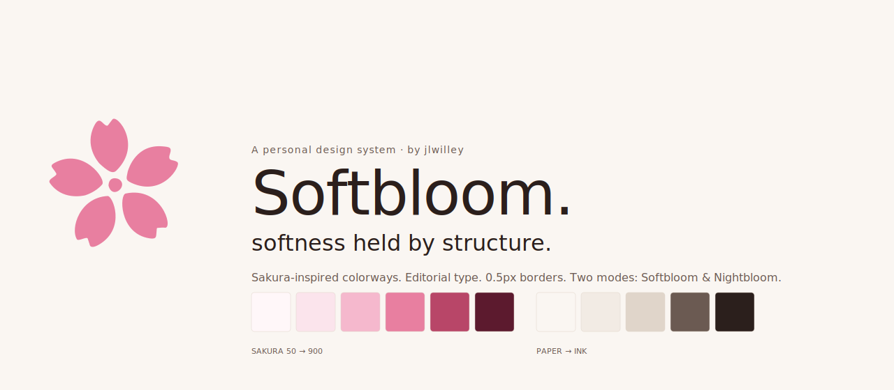
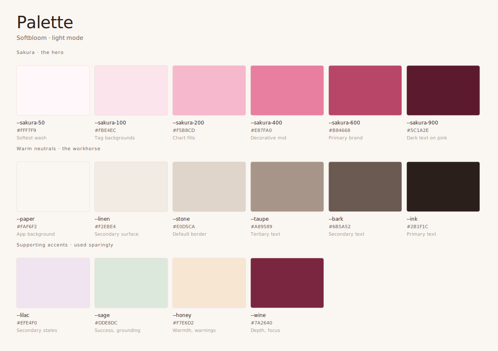
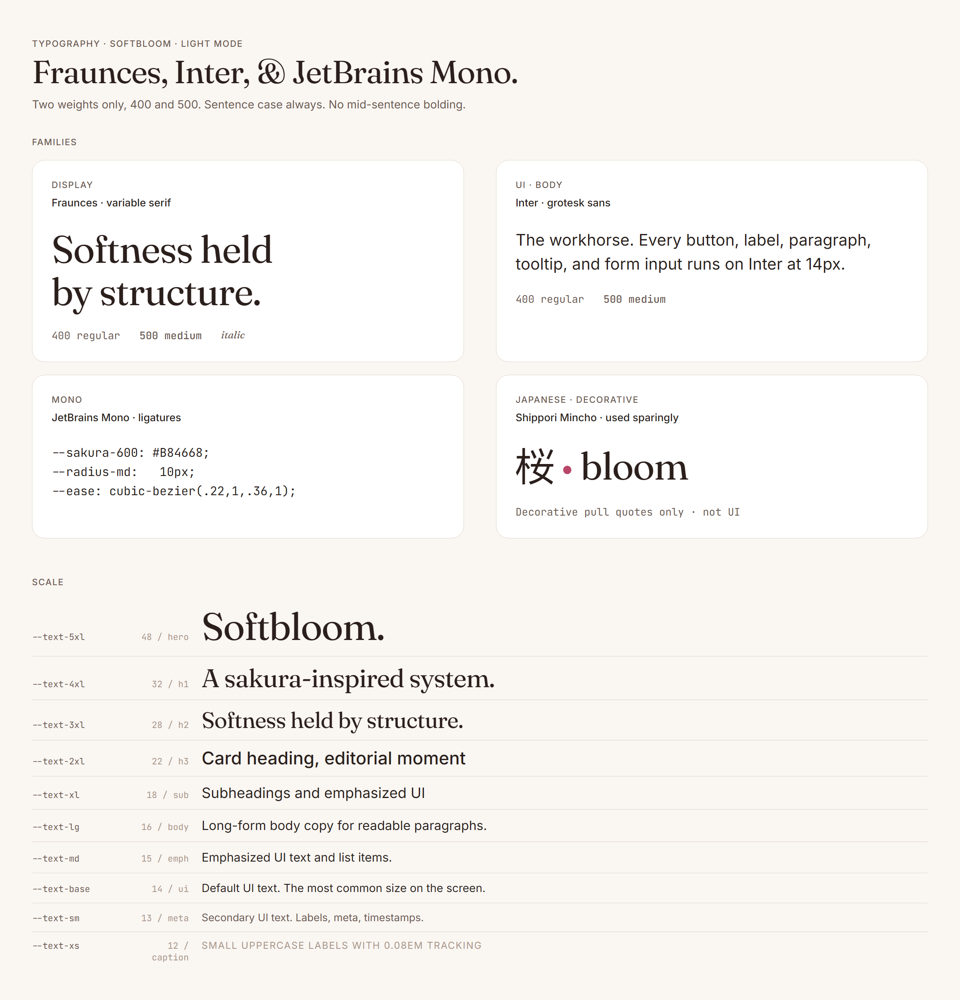
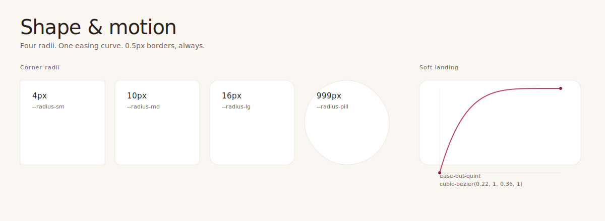
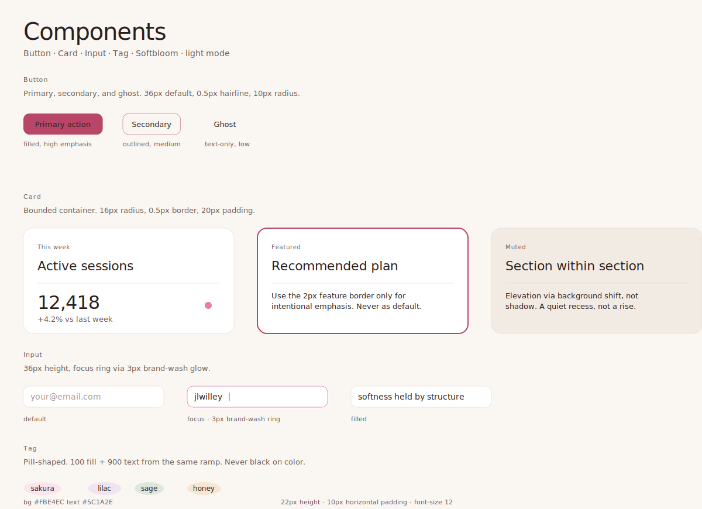
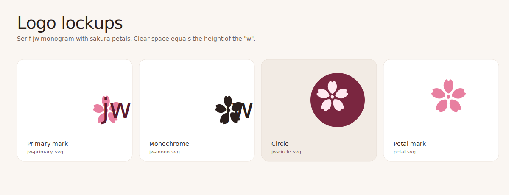

<picture>
  <source media="(prefers-color-scheme: dark)" srcset="docs/readme/hero-dark.svg">
  
</picture>

---

**Softbloom** is a personal design system by [jlwilley](https://github.com/jlwilley). Sakura-inspired, editorial, quiet but confident. Two modes: **Softbloom** (light) and **Nightbloom** (dark). One philosophy: *softness held by structure.*

The rest of this README is a live showcase of the system, rendered from the same tokens that ship in `tokens/`, `css/`, and `tailwind/`.

## Principles

1. **Softness held by structure.** Soft surfaces, confident skeletons.
2. **Pink does emotional work.** Neutrals do the heavy lifting. Never decorate with pink.
3. **Warm neutrals, never cool grays.** Cool grays fight the pink.
4. **0.5px borders, always.** Not 1px. Refinement lives in the details.
5. **Two type weights: 400 and 500.** Never 700.
6. **One decorative element per screen.**
7. **Grayscale test.** If hierarchy fails in grayscale, it fails.

## Palette

Warm neutrals do the heavy lifting. Sakura does the emotional work. Every swatch carries a role, not only a value.

<picture>
  <source media="(prefers-color-scheme: dark)" srcset="docs/readme/palette-dark.svg">
  
</picture>

| Mode | Hero | Ground | Accents |
|------|------|--------|---------|
| **Softbloom** | `--sakura-50` → `--sakura-900` | `--paper` → `--ink` | `--lilac`, `--sage`, `--honey`, `--wine` |
| **Nightbloom** | `--petal` → `--ember` | `--obsidian` → `--midnight` → `--plum` | `--night-lilac`, `--moss`, `--amber`, `--wine` |

Full token reference in [`docs/design-language.md`](docs/design-language.md).

## Typography

Three families. Two weights. One scale.

<picture>
  <source media="(prefers-color-scheme: dark)" srcset="docs/readme/type-specimen-dark.png">
  
</picture>

- **Fraunces** for display. Hero moments, editorial headings, 28px and up.
- **Inter** for UI and body. Everything between 12 and 18 pixels.
- **JetBrains Mono** for code, tokens, data.
- **Shippori Mincho** for Japanese text and sparing decorative moments.

Sentence case always. No mid-sentence bolding. Small uppercase labels render at 12–13px with `letter-spacing: 0.08em`.

## Shape & motion

Four radii. One easing curve. Every standard border is a crisp 0.5px hairline.

<picture>
  <source media="(prefers-color-scheme: dark)" srcset="docs/readme/shape-motion-dark.svg">
  
</picture>

```css
--radius-sm:  4px;    /* chips, tags */
--radius-md:  10px;   /* buttons, inputs */
--radius-lg:  16px;   /* containers, modals */
--radius-pill: 999px; /* badges, avatars */

--ease-soft-landing: cubic-bezier(0.22, 1, 0.36, 1);
--duration-micro: 200ms;  /* hover, focus */
--duration-state: 400ms;  /* open, close */
--duration-page:  600ms;  /* page transitions */
```

## Components

A starter set. Each specimen uses the same tokens you consume, with no extra styling on top.

<picture>
  <source media="(prefers-color-scheme: dark)" srcset="docs/readme/components-dark.svg">
  
</picture>

Full anatomy and code examples in [`docs/components.md`](docs/components.md).

## Logo

A serif `jw` monogram with a five-petal sakura mark. Four lockups, each tuned for a different context.

<picture>
  <source media="(prefers-color-scheme: dark)" srcset="docs/readme/logo-lockups-dark.svg">
  
</picture>

All assets live in [`logo/`](logo/) with usage notes in [`logo/README.md`](logo/README.md).

## Quick start

### Vanilla CSS

```html
<link rel="stylesheet" href="https://cdn.jsdelivr.net/gh/jlwilley/softbloom@main/css/softbloom.css">
```

```css
.card {
  background: var(--color-bg-surface);
  color: var(--color-text-primary);
  border: 0.5px solid var(--color-border);
  border-radius: var(--radius-lg);
  padding: var(--space-5);
  transition: all var(--duration-micro) var(--ease-soft-landing);
}
```

### Tailwind preset

```js
// tailwind.config.js
import softbloom from './path/to/softbloom/tailwind/softbloom.preset.js';

export default {
  presets: [softbloom],
  content: ['./src/**/*.{js,ts,jsx,tsx}'],
};
```

```jsx
<div className="bg-paper text-ink border border-stone rounded-lg p-4">
  <h2 className="font-display text-sakura-600">Hello sakura</h2>
</div>
```

Full consumption guide in [`docs/usage.md`](docs/usage.md).

## Repository

```
softbloom/
├── tokens/          Canonical design tokens (JSON)
├── css/             Derived CSS variables, light + dark
├── tailwind/        Tailwind preset
├── logo/            SVG logo lockups + favicon exports
├── docs/            Design language, components, usage
│   └── readme/      Showcase assets rendered into this README
└── CHANGELOG.md
```

## Versioning

This system follows semantic versioning once published.

- `0.x.x`: active iteration. Breaking changes expected as the system matures.
- `1.0.0`: first stable release. Tokens locked. Changes go through deprecation.

Release history in [`CHANGELOG.md`](CHANGELOG.md).

## Regenerating showcase assets

The images above are generated from a single Python script so they stay in sync with the tokens:

```bash
python docs/readme/build.py
```

Requires Chrome or Edge for the typography specimen (it rasterizes an HTML render with Google Fonts loaded). SVGs render without any external dependency.

## License

MIT. Use it, remix it, make it yours.
